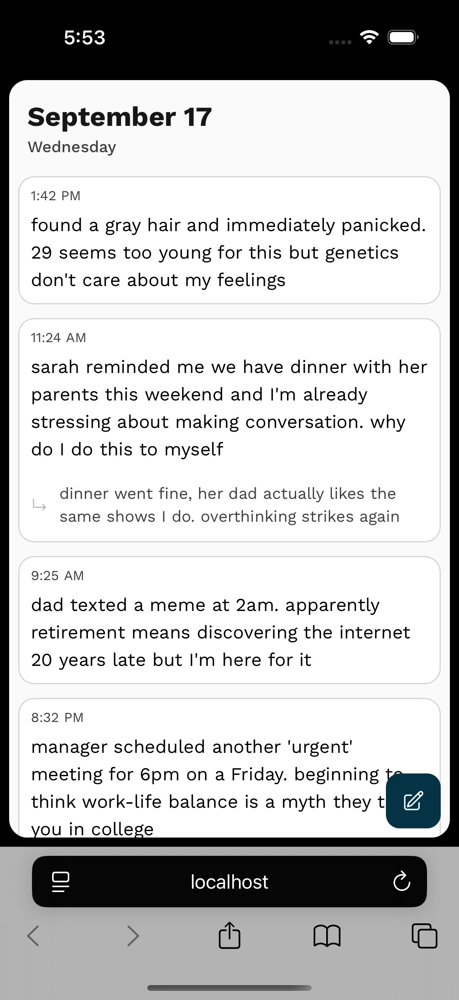
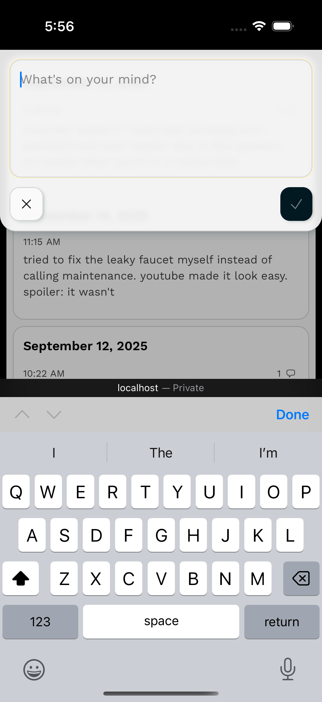
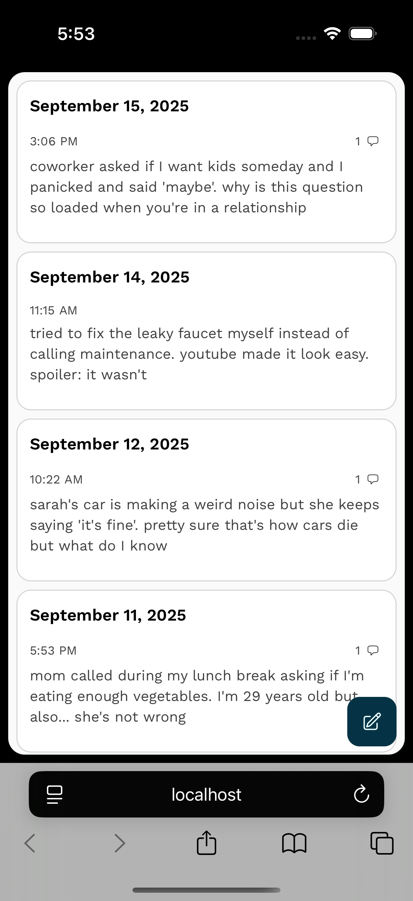
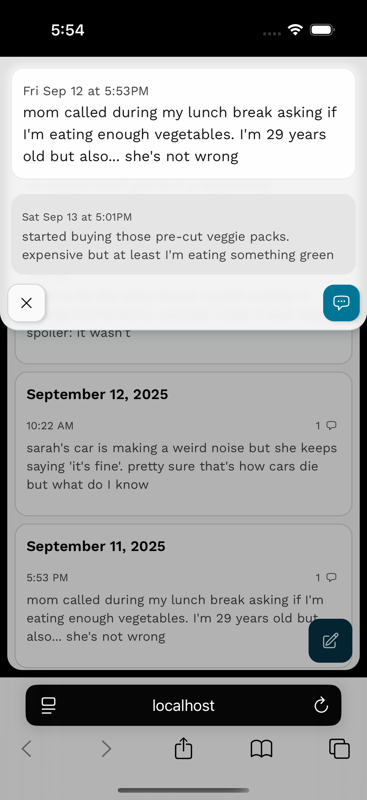
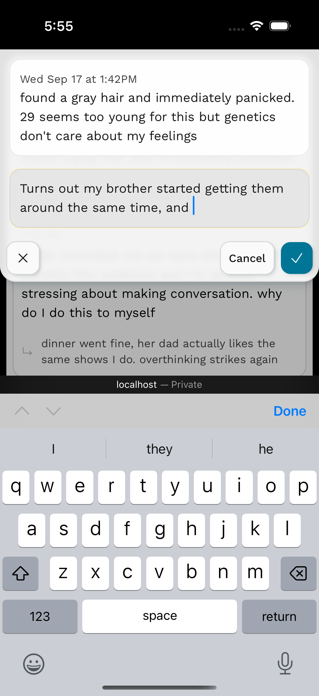

# Journal by Early Bird

A local-first, simple journaling app for daily notes that encourages authentic self-expression.

## Why Journal?

Traditional digital journals make it too easy to self-censor: deleting, editing, and overthinking what you've written. Journal takes inspiration from pen and paper: **each entry, is a snapshot in time**. This encourages honest, unfiltered thoughts without the temptation to perfect or sanitize your authentic voice.

Instead of editing entries, you can reflect on them later by adding comments, creating a natural progression of thoughts over time.

## Features

- **Daily Notes**: Simple, focused journaling for daily reflection
- **Immutable Entries**: Entries can't be edited once created to prevent self-censorship
- **Reflective Comments**: Add comments to entries for later thoughts and insights
- **Local-First**: All data stored in your browser—no servers, no accounts, complete privacy
- **Data Export**: Export your journal data as JSON
- **P2P Sync** *(Coming Soon)*: End-to-end encrypted sync between your devices via WebRTC

## Screenshots

<div align="center">

### Daily Journal View


### New Entry Compose


### Chronological Entries List


### Entry with Comment


### Add Comment Modal


</div>

## Privacy & Data

Your journal data lives **only in your browser**. No servers store your personal thoughts. When P2P sync launches, data will be encrypted end-to-end and transmitted directly between your devices—never touching our servers.

## Development

The project now lives in a single Vite + TypeScript workspace under `src/`, with a single `@/` alias (for example `@/database`, `@/ui`, and `@/utils`) so shared code stays easy to import.

```bash
bun install
bun run dev
```

## Availability

Born out of a personal need for simple and private journaling, Journal by Early Bird will be enhanced and available for public use by the new year.

🌐 Find the proof-of-concept here: [http://journal.rsvzgk29j8.workers.dev](http://journal.rsvzgk29j8.workers.dev)
